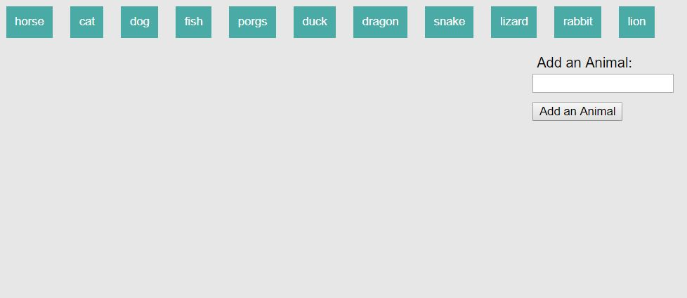
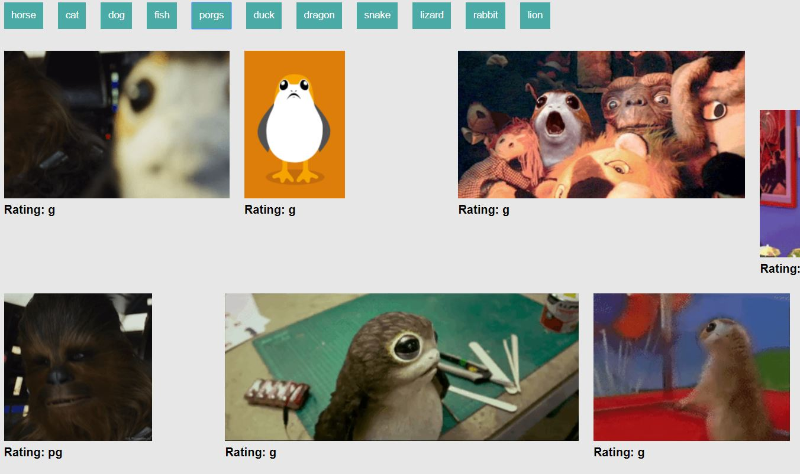

<h1>Giphy!</h2>

This app uses the GIPHY API to make a dynamic web page that populates with gifs of your choice. The app calls the GIPHY API and use JavaScript and jQuery to change the HTML of the site.

The user can stop and start the animated gifs by clicking on them.

As a bonus, the site validates user input by not allowing the user to submit duplicate searches.

